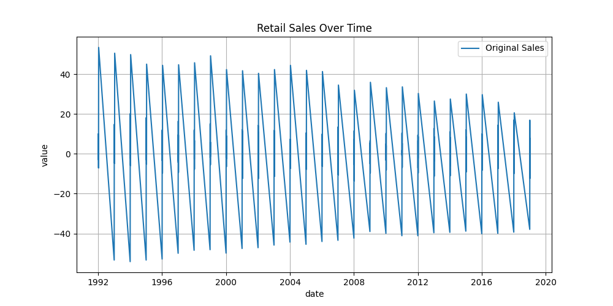
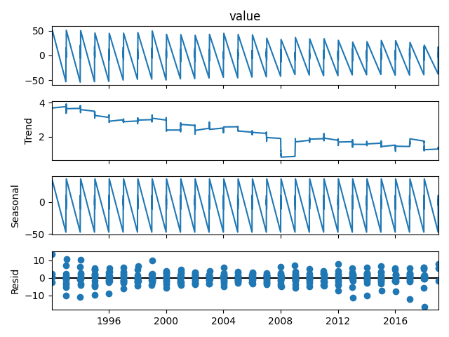
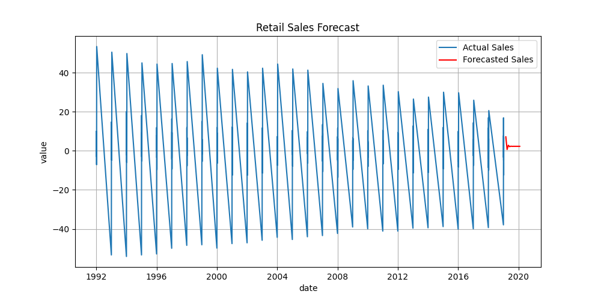

# 🛍️ Retail Sales Forecasting Using ARIMA

This project focuses on analyzing and forecasting retail sales using time series analysis and ARIMA modeling. It includes data preprocessing, trend-seasonality analysis, stationarity testing, model building, forecasting, and evaluation — along with actionable business recommendations for inventory planning.

---

## 📁 Dataset Overview

- **Source**: [retailsales.csv]  
- **Duration**: 1992-01-02 to 2019-01-09 (Monthly data)
- **Columns**:
  - `date`: Date of observation (used as index)
  - `value`: Retail sales value
  - `realtime_start` and `realtime_end`: Metadata (not used in modeling)

---

## 📊 Project Objective

To build a reliable time series model that:
- Understands retail sales trends and seasonality
- Tests for stationarity
- Builds an ARIMA model
- Forecasts future retail sales
- Provides business insights for inventory management

---

## 🧠 Concepts Used

### 1. **Time Series Decomposition**
We break the series into:
- **Trend**: Long-term increase/decrease
- **Seasonality**: Repeating patterns (monthly)
- **Residual**: Random noise

### 2. **Stationarity Testing (ADF Test)**
Stationary series are essential for ARIMA.
- Null Hypothesis (H0): Series is **non-stationary**
- If **p-value > 0.05**: Difference the series
- After differencing, we recheck with ADF

### 3. **ARIMA Model**
- **AR** (Auto Regression): Uses past values
- **I** (Integrated): Differencing to make data stationary
- **MA** (Moving Average): Uses past forecast errors

We used ARIMA(1,1,1) based on simplicity and stationarity test.

### 4. **Forecast Accuracy**
Used:
- **MAE** (Mean Absolute Error)
- **MAPE** (Mean Absolute Percentage Error)

---

## 🧪 Step-by-Step Code Summary

### Step 1: Import Libraries
```python
import pandas as pd, matplotlib.pyplot as plt
from statsmodels.tsa.seasonal import seasonal_decompose
from statsmodels.tsa.stattools import adfuller
from statsmodels.tsa.arima.model import ARIMA
from sklearn.metrics import mean_absolute_error, mean_absolute_percentage_error
```
### Step 2: Load Dataset
```
df = pd.read_csv("retailsales.csv", parse_dates=['date'], index_col='date')
```

### Step 3: Visualize Sales
```
plt.plot(df['value'])  # shows trend and seasonality
```

### Step 4: Decompose Time Series
```
seasonal_decompose(df['value'], model='additive', period=12).plot()
```

### Step 5: Augmented Dickey-Fuller (ADF) Test
```
adfuller(df['value'])  # checks for stationarity
#### If p > 0.05 → do differencing:
df['value'].diff().dropna()
```

### Step 6: Build ARIMA Model
```
model = ARIMA(df['value'], order=(1, 1, 1))
model_fit = model.fit()

```

### Step 7: Forecast Future Sales
```
forecast = model_fit.forecast(steps=12)
```

### Step 8: Evaluate Forecast
```
mae = mean_absolute_error(test, forecast_test)
mape = mean_absolute_percentage_error(test, forecast_test)
```

## 📈 Output Graphs
- 📌 Original Sales Trend

- 🔄 Decomposition: Trend + Seasonality + Residual

- 🔍 ARIMA Forecast vs Actual

- ✅ Forecast Evaluation:

- MAE = 10.93

- MAPE = 124.53% (high error due to volatile data)

## 📦 Business Recommendations
```
📈 Increase inventory during months with high forecasted demand

📉 Reduce inventory during predicted slow months

📊 Monitor MAE & MAPE to understand forecast reliability

🔁 Update model regularly with new sales data
```

## 🚀 Future Improvements
```
Tune ARIMA hyperparameters using AIC/BIC

Try SARIMA for seasonality

Compare ARIMA with LSTM or Facebook Prophet

Add calendar events/holidays for more context
```

## 👩‍💻 Author
```
Vaishnavi Metkar
MSc Statistics | Data Science Enthusiast
GitHub: github.com/vaishnavimetkar
LinkedIn: linkedin.com/in/vaishnavimetkar
```

## 📄 Project Report

Download the full PDF report with explanation, techniques, and output graphs:

👉 [Download PDF Report](./Retail_Sales_Forecasting.pdf)


## 📈 Graphs images

### 1. Time Series Line Plot


### 2. Seasonal Decompostion Plot


### 3. Forecast Plot



## 📌 File Structure
```
Retail-Sales-Forecasting/
│
├── retail_sales_forecasting.py  # main Python script
├── retailsales.csv              # dataset
├── README.md                    # project documentation
├── Retail_Sales_Forecasting.pdf # pdf report
└── images/                      # optional - for EDA and forecast plots
│   ├── timeseriesline_plot.png
│   ├── Seasonaldecomposition_plot.png
│   └── forecast_plot.png
```